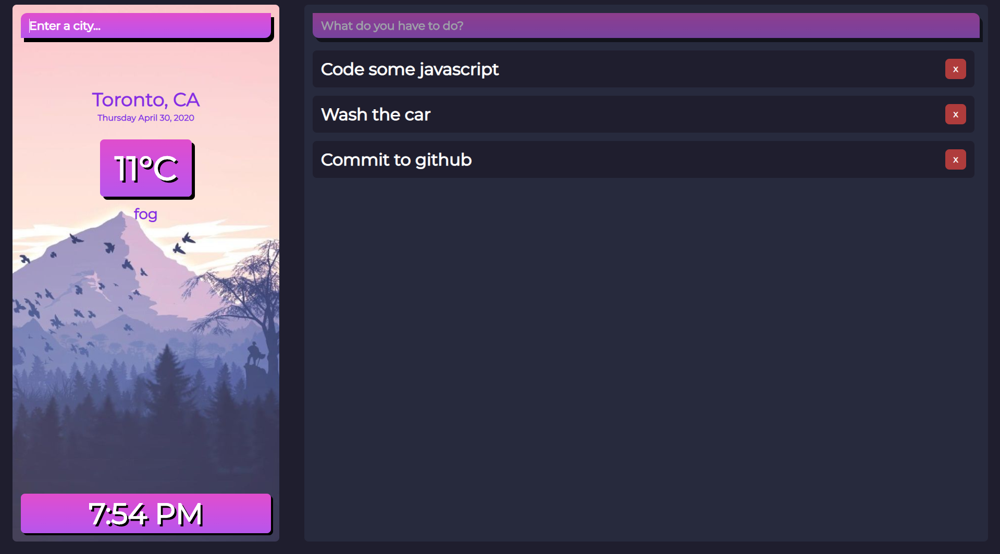

# Weather-Todo
A simple weather and todo app combined into one!

Built using the MEVN Stack 
Mongodb: Store todolist items 
Express.js: Server for taking user requests and adding/deleting todo items 
Vue.js: Frontend framework used to make ui. 
Node: Javascript runtime environment 

